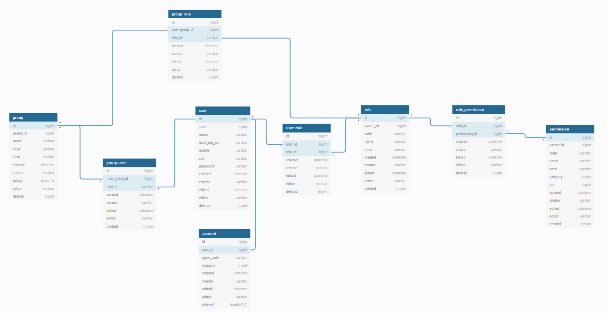

# 帐号设计

在绝大部分的微服务平台中，都会涉及到：

1. 账户表（account）
2. 用户表（user）
3. 权限表（permission）
4. 角色表（role）
5. 用户组表（group）

这些通用数据表。在这几张表之间又会存在一些非常通用的关系以及相同的处理方式。

1. 用户角色表（user_role）
2. 角色权限表（role_permission）
3. 用户分组表（group_user）
4. 用户组角色表（group_role）

在这里，基于角色访问控制（Role-Based-Access-Control）来设计。

> RBAC是指用户通过角色和权限进行关联，即一个用户拥有若干角色，每一个角色拥有若干权限。**这样就构成了“用户-角色-权限”的授权模型**。在这种模型中，用户与角色之间、角色与权限之间，一般都是多对多的关系。

表之间的关系如下图所示：

见表语句在[这里](../pkg/create-table.sql)。

## 账户表

在系统中，会有各种各样的登录方式，如手机号、邮箱、微信等。因此这个表**主要用来记录每一种登录方式的信息，但不包含密码信息**，因为各种登录方式都会使用同一个密码，每个密码都会关联到唯一的一条用户记录。

## 用户表

**主要用来记录用户的基本信息和密码信息**，其中：

- `state`字段是在后台管控非法用户时使用，
- `salt`字段用于给每一个用户的登录密码加一把唯一的锁，即使攻击加密公钥泄露后，也不会导致全部用户的密码泄露。

账户表和用户表组合在一起，就完成了用户帐号模块的设计，还可以继续细分为三张表：

- 账户表：存储帐号相关信息（不包含登录帐号）
- 用户信息表：存储用户基本信息（不包含密码）
- 登录表：存储每一种登录方式的信息（不包含密码）

> 如果用户信息的字段过多，还可以继续拆分为多张不同领域的用户信息表。

## 权限表

不同的用户能操作和查看不同的功能（如页面、菜单等），权限表**主要用来存储权限相关的信息**。

- `parent_id`字段表示权限之间的父子关系，分配了父级权限后，应该拥有所有子级权限
- `code`字段用于唯一表示具体的权限

> 可以创建用户权限表（user_permission），用于指定每个用户所拥有的权限，但是会有一些问题，如：中间数据量庞大，新增或编辑时操作的数据量庞大等。可以引入角色表（role）和用户组表（group）来解决这个问题。

## 角色表

为了解决维护的问题，对权限表进行分组，将相关的权限分配为同一个组，这就形成了角色。**主要是为了将零散的权限进行聚合，然后方便对相关的一组进行统一处理（小范围批处理）**。

## 用户角色表

**主要用来存储每个用户拥有哪些角色**，一般情况下，一个用户只会拥有几个角色。

## 角色权限表

**定义每个角色中有哪些权限**，这个表的数量会更少。

## 用户组表

**主要是将用户进行分类**。

用户组和角色的区别：

- 角色：解决的是权限的分组，减少权限的重复分配
- 用户组：解决的是用户的分组，减少用户的重复授权

## 用户分组表

**主要用来记录每个用户组中包含的用户**。

## 用户组角色表

**主要用来记录每个用户组拥有哪些角色**。

在每个系统中，主体用户都会占全部用户的90%以上，因此每个用户注册时都需要分配一条所属用户组，这样就可以完成用户的授权。
